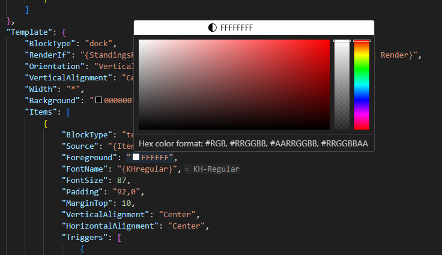
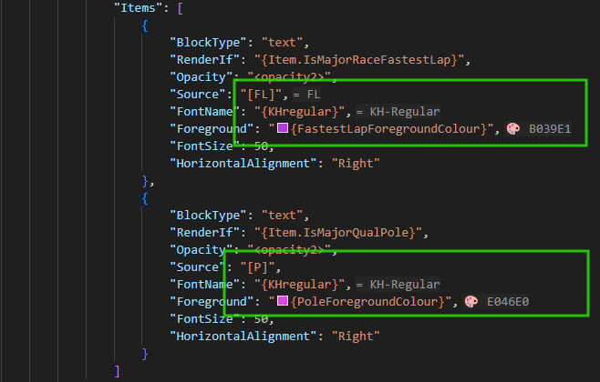

# RLT Theme Helper

> **Complete development toolkit for Racing League Tools Themes**

Powerful VS Code extension that enhances your RLT theme development workflow with interactive color picker, smart variable hints, comprehensive JSON validation, and code snippets.

## 📋 Requirements

- VS Code 1.88.0 or higher
- Racing League Tools themes workspace

## ✨ Features

### 🎨 Interactive Color Picker

Click on the color box next to any color value to open an interactive color picker with instant preview.

**Supported Color Formats:**

- `#RRGGBB` - Standard hex format (e.g., `#FF5733`)
- `#AARRGGBB` - RLT format with alpha channel first (e.g., `#80FF5733`)
- `RRGGBB` / `AARRGGBB` - Hex format without # for Color/Foreground/Background properties
- `R,G,B` - Comma-separated RGB values (e.g., `255,87,51`)
- `R,G,B,A` - Comma-separated RGBA values (e.g., `255,87,51,128`)

**Key Features:**

- 🎯 Visual color indicators appear next to all color values
- 🔄 Easy conversion between different color formats via dropdown
- 🧠 Smart detection - automatically excludes layout properties (margin, padding, spacing, etc.)
- 📦 Global variables that resolve to colors show color indicators (read-only)



### 💡 Global Variables Inline Hints

See resolved values of your variables directly in the editor as grayed-out inline hints - no need to constantly check `global_vars.json`!

**Supported Variable Formats:**

```json
{
  "SimpleVariable": "{VariableName}",
  "DoubleBrace": "{{VariableName}}",
  "NestedProperty": "{Variable.Property.SubProperty}",
  "ComplexNested": "{Some{Nested}Value}",
  "Localization": "[LocalizationKey]"
}
```

**Key Features:**

- 👁️ Inline hints show resolved values next to variable references
- 🎨 Color indicators for variables that resolve to color values
- 🌍 Smart localization file selection based on `DefaultLocalizationId` in `theme_description.json`
- 🔗 Clickable tooltips to quickly navigate to variable definitions
- ⚡ Real-time updates when `global_vars.json` or localization files change
- 🧩 Full support for complex nested variable resolution



### ⌨️ Keyboard Shortcuts

Boost your productivity with convenient keyboard shortcuts:

| Shortcut | Command | Description |
|----------|---------|-------------|
| `Ctrl+K Ctrl+S` | Show RLT Snippets | Opens quick pick menu with code snippets |
| `Ctrl+K Ctrl+V` | Add Global Variable | Smart variable insertion and creation |

#### Add Global Variable Command

**With text selected:**

1. Select text (e.g., `#FF5733`)
2. Press `Ctrl+K Ctrl+V`
3. Enter variable name (e.g., `PrimaryColor`)
4. Selection is replaced with `{PrimaryColor}`
5. `globals/global_vars.json` is created/updated with value `#FF5733`
6. File opens with value selected, ready to edit

**Without selection:**

1. Press `Ctrl+K Ctrl+V`
2. Enter variable name
3. `{VariableName}` is inserted at cursor
4. Variable created in `global_vars.json` with empty value

**Customize Shortcuts:**

1. Press `Ctrl+K Ctrl+S` to open Keyboard Shortcuts
2. Search for "rlt-theme-helper"
3. Click any keybinding to customize

### 📝 Code Snippets

Place your cursor where you want to insert a block and press `Ctrl+K Ctrl+S` to choose from available snippets. Navigate through placeholders using `Tab`.

**Available Snippets:**

- 📦 BlockRoot
- 🖼️ Canvas
- 🎨 ColorizeBackground
- 🧩 Component (create & use)
- ⚓ Dock
- 🖼️ Image
- 📚 ItemStack
- 🔧 Public Property
- ⬜ Shape
- 📚 Stack
- 💅 Style (definition)
- 📊 Table & Table Columns
- 📝 Text
- 🎭 Theme Description & Link
- ⚡ Triggers & Setters

### ✅ JSON Validation & IntelliSense

Comprehensive JSON schema validation with detailed property hints for:

- 📄 **Layer files** (`layer.json`) - Block structure validation
- 🧩 **Components** - Component definition validation
- 🌍 **Variables** - Global and public variables
- 📐 **Layouts** - Layout and theme descriptions
- 🌏 **Localizations** - Localization file validation

### 🔍 Completion Providers

Smart auto-completion for:

- **Global Variables** - Shows list with current values (press `Ctrl+Space`)
- **Component Names** - Available components in your theme
- **Style Names** - Defined styles
- **Data Converters** - Built-in converter functions


## 🚀 Getting Started

1. Install the extension from VS Code Marketplace
2. Open your RLT theme workspace
3. Start editing JSON files - features activate automatically!

## 📖 Version Support

Current scope: **RLT Themes 0.9.6**

## 🤝 Contributing

Found a bug or have a feature request? Please open an issue on [GitHub](https://github.com/kaaac/rlt-theme-helper).

## 📝 License

See [LICENSE.md](LICENSE.md) for details.

## 📋 Changelog

See [CHANGELOG.md](CHANGELOG.md) for a complete list of changes and version history.

## 🎉 Enjoy

Made with ❤️ for the Racing League Tools community
