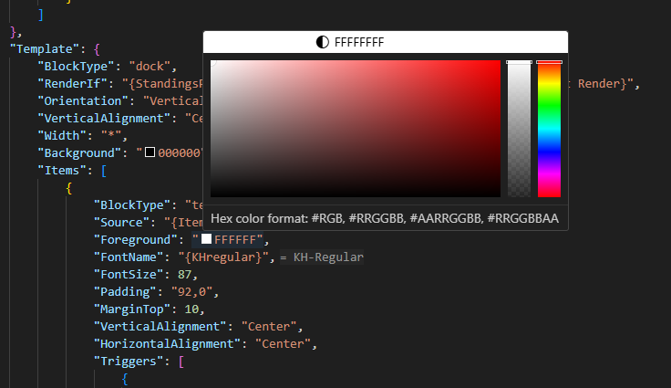
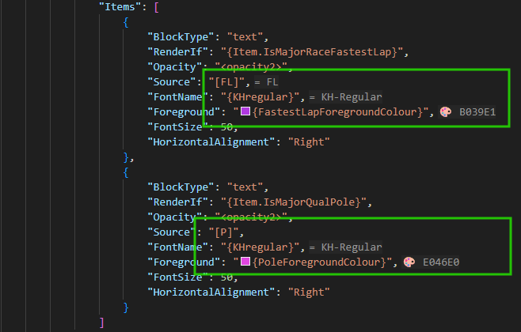
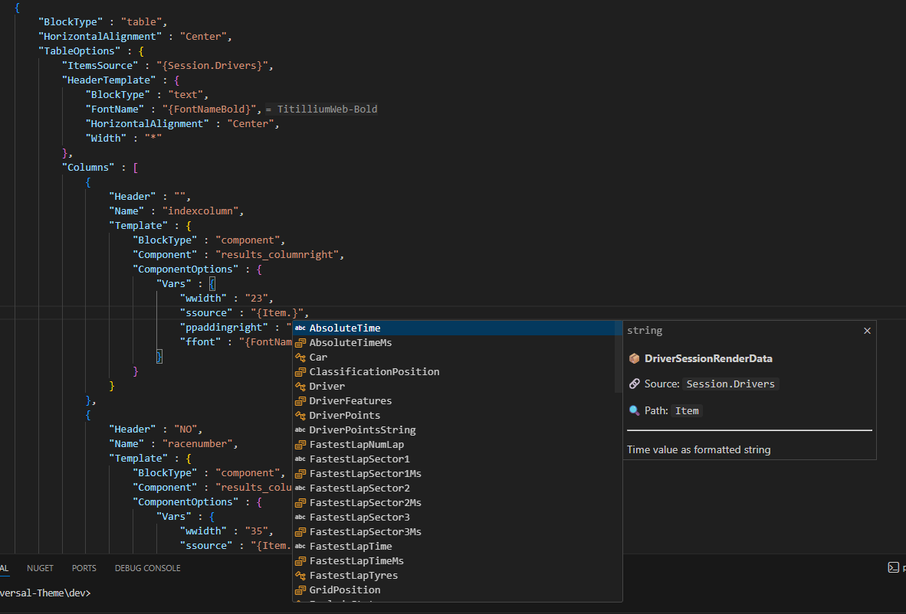
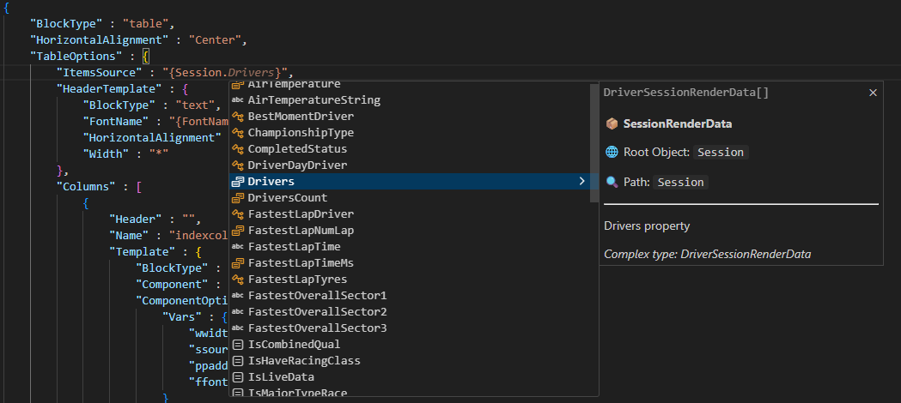

# RLT Theme Helper

> **Complete development toolkit for Racing League Tools Themes**

Powerful VS Code extension that enhances your RLT theme development workflow with interactive color picker, smart variable hints, comprehensive JSON validation, and code snippets.

## 📋 Requirements

- VS Code 1.88.0 or higher
- Racing League Tools themes workspace

## ✨ Features

### 🎨 Interactive Color Picker

Click on the color box next to any color value to open an interactive color picker with instant preview.

**Supported Color Formats:**

- `#RRGGBB` - Standard hex format (e.g., `#FF5733`)
- `#AARRGGBB` - RLT format with alpha channel first (e.g., `#80FF5733`)
- `RRGGBB` / `AARRGGBB` - Hex format without # for Color/Foreground/Background properties
- `R,G,B` - Comma-separated RGB values (e.g., `255,87,51`)
- `R,G,B,A` - Comma-separated RGBA values (e.g., `255,87,51,128`)

**Key Features:**

- 🎯 Visual color indicators appear next to all color values
- 🔄 Easy conversion between different color formats via dropdown
- 🧠 Smart detection - automatically excludes layout properties (margin, padding, spacing, etc.)
- 📦 Global variables that resolve to colors show color indicators (read-only)



### 💡 Global Variables Inline Hints

See resolved values of your variables directly in the editor as grayed-out inline hints - no need to constantly check where a variable is defined!

**Supported Variable Formats:**

```json
{
  "SimpleVariable": "{VariableName}",
  "DoubleBrace": "{{VariableName}}",
  "NestedProperty": "{Variable.Property.SubProperty}",
  "ComplexNested": "{Some{Nested}Value}",
  "Localization": "[LocalizationKey]"
}
```

**Key Features:**

- 👁️ Inline hints show resolved values next to variable references
- 🎨 Color indicators for variables that resolve to color values
- 🌍 Smart localization file selection based on `DefaultLocalizationId` in `theme_description.json`
- 🔗 Clickable tooltips to quickly navigate to variable definitions
- ⚡ Real-time updates when `global_vars.json` or localization files change
- 🧩 Full support for complex nested variable resolution



### 🔮 Item Property Autocomplete

Get intelligent autocomplete for `Item.*` properties based on your `ItemsSource` context - powered by real C# API models from RacingLeagueTools.

**Supported Patterns:**

- `{Item.` - Autocomplete based on the nearest `ItemsSource` in parent blocks, or on the component's usage in layouts
- `{ParentItem.` - Item of the outer iteration in nested tables and item stacks
- `{Session.`, `{Standings.`, `{DriverStatistics.`, ... - All root objects of the Flex Renderer data model
- `{Item.Team.Nation.Code}` - Full nested navigation with autocomplete at each level
- `{Item.Driver0.Name}` - Collection indexing support (Driver0, Driver1, etc.)

**Key Features:**

- 🎯 Context-aware suggestions based on actual C# data types
- 📦 Works in components - automatically finds `ItemsSource` from layout usage
- 🔗 Shows inherited properties from base classes
- 📝 Rich documentation with property types (string, int, bool, collections)
- 🌐 Based on 101 classes of the RLT Renderer API v0.9.8
- 🧭 `DriverInfo` and `Penalties` follow the layout's `RenderType`
- 📊 Context info display - see which object type you're working with

**Coverage:**

Session, Season, Standings, Championship, Statistics, Penalties, League roles, and more - with full inheritance chains and nested object navigation.





### 🧭 Go to Definition & Hover

`Ctrl+Click` (or `F12`) on a style, component or trigger name, a `{Variable}`, `<PublicProperty>` or `[LocalizationKey]` to jump to its definition. Hover over a style, component or trigger name to see where it's defined, its definition and - for styles - the `StyleBasedOn` chain.

Names and variables are looked up in the same order as the renderer:

- **Styles, components, triggers** - enclosing blocks → layer folder → layout folder → theme
- **Variables** - block `Vars` → public properties → localization `Vars` → layer / layout / theme `vars/` → `global_vars.json`

### ⚠️ Warnings

Unknown style, component and trigger names and `{Variables}` are underlined as warnings. When a similar name exists, a quick fix (`Ctrl+.`) offers to change it - e.g. `DarkBleu` → `DarkBlue`.

To avoid false alarms, expressions, sort/filter members, component parameters passed in `ComponentOptions.Vars`, variables set by triggers and names differing only in letter case are not reported. Warnings can be turned off with the `rltThemeHelper.diagnostics.enabled` setting.

### ⌨️ Keyboard Shortcuts

Boost your productivity with convenient keyboard shortcuts:

| Shortcut | Command | Description |
|----------|---------|-------------|
| `Ctrl+Alt+R S` | Show RLT Snippets | Opens quick pick menu with code snippets (JSON files) |
| `Ctrl+Alt+R V` | Add Global Variable | Smart variable insertion and creation (JSON files) |

#### Add Global Variable Command

**With text selected:**

1. Select text (e.g., `#FF5733`)
2. Press `Ctrl+Alt+R V`
3. Enter variable name (e.g., `PrimaryColor`)
4. Selection is replaced with `{PrimaryColor}`
5. `globals/global_vars.json` is created/updated with value `#FF5733`
6. File opens with value selected, ready to edit

**Without selection:**

1. Press `Ctrl+Alt+R V`
2. Enter variable name
3. `{VariableName}` is inserted at cursor
4. Variable created in `global_vars.json` with empty value

**Customize Shortcuts:**

1. Open *File → Preferences → Keyboard Shortcuts*
2. Search for "RLT"
3. Click any keybinding to customize

### 📝 Code Snippets

Place your cursor where you want to insert a block and press `Ctrl+Alt+R S` to choose from available snippets. Navigate through placeholders using `Tab`.

**Available Snippets:**

- 📦 BlockRoot
- 🖼️ Canvas
- 🎨 ColorizeBackground
- 🎭 Colorize image mask
- 🧩 Component (create & use)
- ⚓ Dock
- 🔲 Grid
- 🖼️ Image
- 📚 ItemStack
- 📐 Layout Description
- 🌍 Localization
- 🔧 Public Property
- ⬜ Shape
- 📚 Stack
- 💅 Style (definition)
- 📊 Table & Table Columns
- 📝 Text
- 🎭 Theme Description & Link
- ⚡ Triggers & Setters (incl. external trigger)

### ✅ JSON Validation & IntelliSense

Comprehensive JSON schema validation with detailed property hints for:

- 📄 **Layers** (`layer*.json` and `layer*/<file>.json`) - Block structure validation
- 🧩 **Components** - Component definition validation
- 💅 **Styles** (`styles/` at any level, `styles.json`) - Styles validated as full blocks
- ⚡ **Triggers** (`triggers/` folders) - One trigger or a list of triggers
- 🌍 **Variables** - `global_vars.json`, `vars/` folders and public properties
- 📐 **Layouts** - Layout and theme descriptions
- 🌏 **Localizations** - Localization file validation
- 🧮 Expressions (`{...}`) and public properties (`<...>`) accepted in all block properties

### 🔍 Completion Providers

Smart auto-completion for:

- **Global Variables** - Shows list with current values (press `Ctrl+Space`)
- **Component Names** - Available components in your theme with clickable links to source files
- **Style Names** - Defined styles with clickable links to source files
- **Trigger Names** - Available triggers in your theme with clickable links to source files
- **Data Converters** - all 38 documented converters with parameter type and example

**Enhanced Documentation:**
- 🔗 Clickable links to source files for Components, Styles, and Triggers
- 📍 Displays whether item is defined globally or locally
- 🎨 Color icon for Style completions


## 🚀 Getting Started

1. Install the extension from the VS Code Marketplace or Open VSX
2. Open your RLT theme workspace
3. Start editing JSON files - features activate automatically!

## 📖 Version Support

Current scope: **RLT 0.9.9** (Renderer API v0.9.8)

## 🤝 Contributing

Found a bug or have a feature request? Please open an issue on [GitHub](https://github.com/kaaac/rlt-theme-helper).

### Development

```bash
npm install
npm run build        # bundle src/ into dist/extension.js
npm run watch        # rebuild on change
npm test             # unit tests (sample theme in test/fixtures)
npm run lint
npm run typecheck
npm run generate:models   # regenerate api_models/ from the RLT Renderer API
```

Press `F5` (or `Ctrl+F5` without debugger) in VS Code to start an Extension Development Host.

| Path | Contents |
|---|---|
| `src/extension.ts` | activation, provider registration, status bar |
| `src/core/` | theme context (theme root, cached global vars / localizations / name indexes), JSON, variables, colors |
| `src/providers/` | completion, color picker, inlay hints, commands |
| `test/` | mocha unit tests, `vscode` API mock, sample theme fixture |
| `api_models/` | generated API models used by `Item.` completion |
| `json_schemas/` | JSON schemas for theme files |
| `scripts/` | API model generator |

## 📝 License

See [LICENSE.md](LICENSE.md) for details.

## 📋 Changelog

See [CHANGELOG.md](CHANGELOG.md) for a complete list of changes and version history.

## 🎉 Enjoy

Made with ❤️ for the Racing League Tools community
